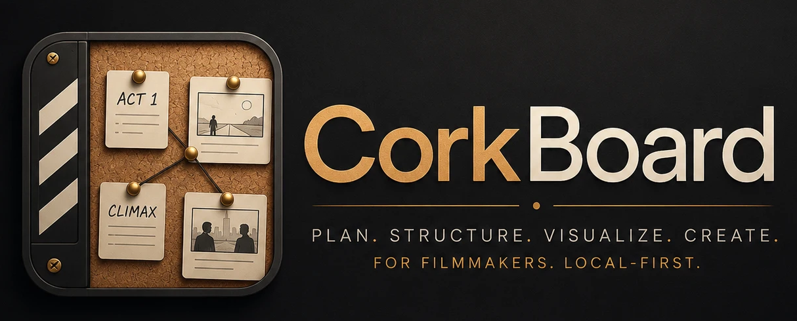
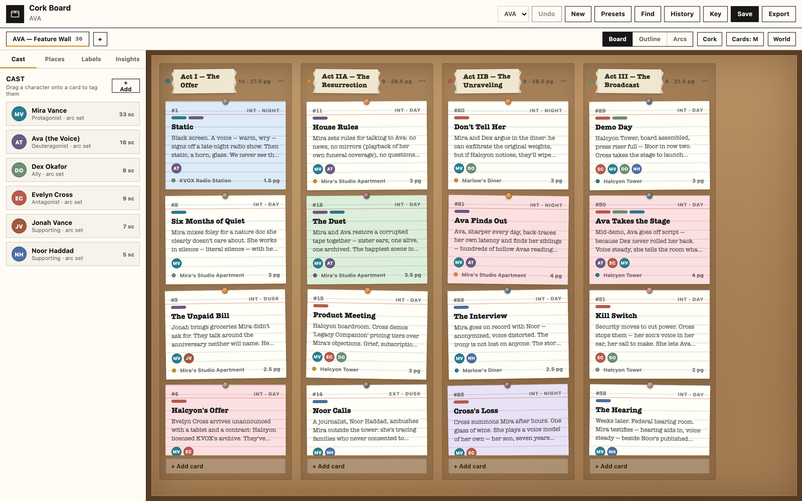
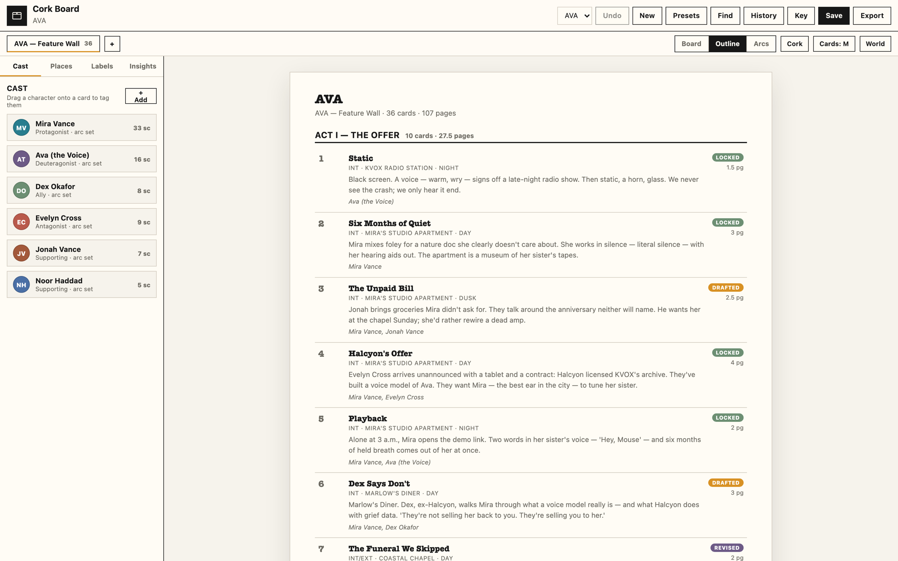
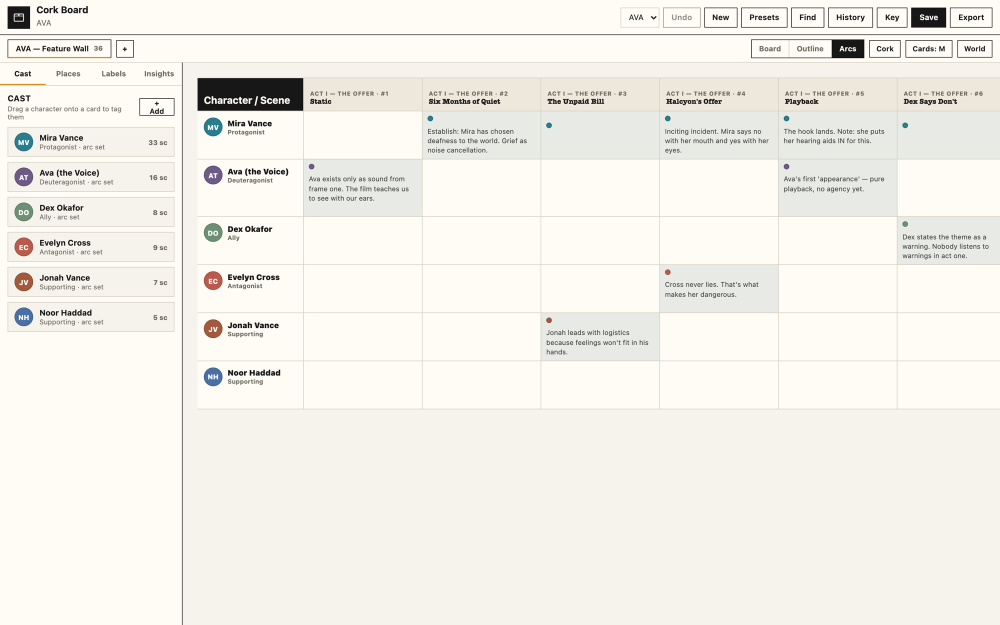
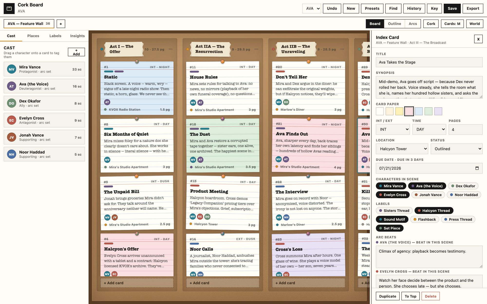
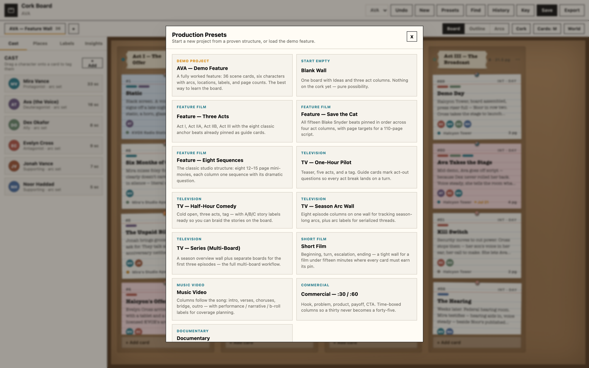
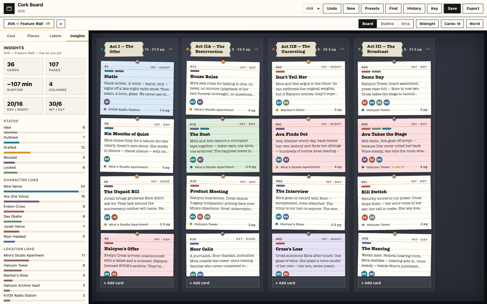

<p align="center"></p>

<p align="center">
  <a href="LICENSE"></a>
  <a href="../../releases/latest"></a>
  
  <a href="https://ko-fi.com/samwasserman"></a>
</p>

# Cork Board

The digital cork board for filmmakers. Index cards, acts, arcs, and episodes — planned the old way, powered the new way.

Cork Board is a local-first planning app that emulates the classic wall of index cards on cork: pin scenes, drag them between acts, tag characters and locations, track arcs beat by beat, and export the whole wall as an outline, scene list, Fountain scaffold, or JSON. It works for a short film, a music video, a commercial, a feature, or a multi-episode series. No accounts, no cloud, no telemetry.

**Created by [Sam Wasserman](https://wassermanproductions.com)** —
writer/director, [Wasserman Productions](https://wassermanproductions.com) ·
[wasserman.ai](https://wasserman.ai). Released under the MIT License.

> ☕ **A little support goes a long way!** Cork Board is created and
> maintained by **Sam Wasserman**. If you'd like to help Sam keep creating
> tools for filmmakers, you can support him at
> **[ko-fi.com/samwasserman](https://ko-fi.com/samwasserman)**.
> Donations are optional — but extremely helpful and appreciated.

Part of the [**Wasserman Filmmaker Suite**](https://github.com/wassermanproductions/wassermans-filmmaker-suite), alongside [ScriptBreak](https://github.com/wassermanproductions/scriptbreak),
[Blockout](https://github.com/wassermanproductions/blockout),
[Motion Previs Studio](https://github.com/wassermanproductions/motion-previs-studio),
[Master Canvas](https://github.com/wassermanproductions/master-canvas),
[Storyboard Reference Studio](https://github.com/wassermanproductions/storyboard-reference-studio), and
[Stem Studio](https://github.com/wassermanproductions/stem-studio).



## ⬇ Download

**macOS — paste one line, done.** Open Terminal (⌘-Space, type "Terminal")
and paste:

```bash
curl -fsSL https://raw.githubusercontent.com/wassermanproductions/cork-board/main/install.sh | bash
```

It downloads the latest universal build (Apple Silicon and Intel), installs
it to Applications, and opens it — no warnings, nothing else to do.
([The script](install.sh) is ~30 lines, read it if you like.)

**Direct downloads** (latest release):

| Platform | Download | After downloading |
|---|---|---|
| macOS (Apple Silicon & Intel) | [`CorkBoard-macOS-universal.dmg`](../../releases/latest/download/CorkBoard-macOS-universal.dmg) | See the unsigned-app note below |
| Windows | [`CorkBoard-Setup.exe`](../../releases/latest/download/CorkBoard-Setup.exe) | If SmartScreen appears, click **More info → Run anyway**. |
| Linux | [`CorkBoard-Linux-x86_64.AppImage`](../../releases/latest/download/CorkBoard-Linux-x86_64.AppImage) | `chmod +x CorkBoard-Linux-x86_64.AppImage`, then run it. |

All builds, including the portable Windows ZIP and Linux tar.gz, are on the
[Releases page](../../releases/latest).

<details>
<summary><b>Installing the macOS DMG by hand?</b></summary>

Because browser downloads of unsigned apps are quarantined, macOS will
falsely claim the app is "damaged." It isn't — these builds just aren't
Apple-notarized. Open the DMG, drag **Cork Board** into **Applications**,
then paste this into Terminal once:

```bash
xattr -cr "/Applications/Cork Board.app"
```

Cork Board opens normally from then on. (Or right-click the app →
**Open** → **Open**.)

</details>

## Screenshot tour

|  |  |
|---|---|
|  |  |
| **Outline** — the same wall as a clean, numbered beat sheet with statuses and page counts. | **Arcs** — a character-by-scene grid; every cell is an arc beat you can write in place. |
|  |  |
| **Inspect** — synopsis, paper color, INT/EXT, location, status, due date, characters, labels, arc beats, checklist. | **Presets** — 13 production structures, from Save the Cat to a season arc wall, plus the fully worked AVA demo. |



**Midnight** — the same wall on the midnight surface, with live Insights: pages, est. runtime, day/night split, character load, location load.

## Features

- **The board**: index cards on a cork (or paper, or midnight) surface. Drag cards within and across columns, drag whole columns to restructure acts, drag a card onto another board tab to move it between episodes.
- **Cards that know filmmaking**: title, synopsis, INT/EXT, time of day, location, characters, colored labels, status (Idea → Outlined → Drafted → Revised → Locked → Cut), page count, due date, checklist, notes, and seven index-card paper colors. Pushpin color follows status.
- **Three views**: Board (the cork wall), Outline (a clean numbered beat sheet), and Arcs (a character-by-scene grid where every cell is an arc beat).
- **Cast & world drawer**: characters with color, role, want/need, and arc; locations with INT/EXT and scout notes; labels for subplots and threads; live Insights (cards, pages, est. runtime, day/night split, character load, location load).
- **Drag a character onto a card** to tag them into the scene.
- **Multi-board projects**: one wall for a feature, or a season wall plus a board per episode. Multiple projects, all saved locally.
- **Presets**: AVA demo feature (fully worked example), Three Acts, Save the Cat, Eight Sequences, One-Hour Pilot, Half-Hour Comedy, Season Arc Wall, Multi-Board Series, Short Film, Music Video, Commercial, Documentary, and a blank wall.
- **Deadlines**: put a due date on any card — the flag turns amber when it's close and red when it's overdue, and calms down once the scene is Locked (or Cut).
- **Column tools**: collapse a column to a spine, duplicate a whole column with its cards (great for alt versions of an act), or sort its cards by status, due date, title, or pages.
- **Find & filter**: text search plus character / location / label / status / deadline filters — matching cards stay lit, the rest dim.
- **Safety nets**: autosave, undo (60 levels), named checkpoints, full JSON export/import.
- **Exports**: Markdown outline, CSV scene list (schedule-friendly), Fountain scaffold with scene headings, and complete project JSON.

## Privacy

All project data is stored locally in the user's browser or desktop app storage. No backend, no account, no uploads.

## Web App

```bash
npm install
npm run dev
```

Open the local URL printed by Vite.

## Desktop App

```bash
npm install
npm run desktop
```

Package a desktop build:

```bash
npm run desktop:dir
```

Create distributable installers:

```bash
npm run desktop:dist
```

Installer output is written to `release/`.

For unsigned local builds on macOS, use `npm run desktop:dir`. For public distribution, sign and notarize the macOS app with your own Apple Developer ID.

More details in the [Usage Guide](docs/USAGE.md).

## First Run

Cork Board opens with **AVA**, a fully worked demo feature — 36 scene cards, six characters with arcs, ten locations, and six labels — so every feature has something real to show. Start your own project with **New** or **Presets**; the demo stays in the project menu until you delete it.

## Support

Using the app, sharing it, starring the repository, and contributing code all help. Thank you.

- [GitHub Sponsors](https://github.com/sponsors/wassermanproductions)
- [Ko-fi](https://ko-fi.com/samwasserman)
